<!-- Generated by SpecStory -->

# Metafi homepage proposed architecture diagram (2026-02-02 16:15:32)

_**User**_

can you give me a valid mermaid diagram  of how you would structure the metafi homepage with your proposed architecture@documentation/content-model-proposal.md 

---

_**Assistant**_

---

---

---

Here's a Mermaid diagram showing how the MetaFi homepage would be structured with the proposed architecture:

```mermaid
flowchart TB
    subgraph Page ["📄 Page: Homepage"]
        PageEntry["<b>page</b><br/>slug: '/'<br/>title: 'MetaFi - Modern Banking'"]
    end

    subgraph Sections ["Sections (Direct References)"]
        direction TB
        Hero["<b>hero</b><br/>variant: 'default'<br/>headline: 'Modern Banking...'"]
        Logos["<b>logos</b><br/>variant: 'marquee'<br/>headline: 'Trusted by'"]
        Features["<b>features</b><br/>variant: '2x2'<br/>headline: 'Powerful Features'"]
        Testimonials["<b>testimonials</b><br/>variant: 'carousel'<br/>headline: 'What Our Users Say'"]
        Pricing["<b>pricing</b><br/>variant: 'default'<br/>showToggle: true"]
        FAQ["<b>faq</b><br/>headline: 'Questions?'"]
        CTA["<b>cta</b><br/>variant: 'banner'<br/>headline: 'Get Started'"]
    end

    subgraph Nested ["Nested Items"]
        direction LR
        F1["feature<br/>Checkout"]
        F2["feature<br/>Invoicing"]
        F3["feature<br/>Payments"]
        F4["feature<br/>Recurring"]
        
        T1["testimonial<br/>Jane D."]
        T2["testimonial<br/>John S."]
        
        P1["pricingPlan<br/>Starter"]
        P2["pricingPlan<br/>Pro"]
        P3["pricingPlan<br/>Enterprise"]
        
        FQ1["faqItem"]
        FQ2["faqItem"]
    end

    subgraph Shared ["Shared/Reusable"]
        direction LR
        Btn1["<b>button</b><br/>label: 'Get Started'<br/>variant: 'primary'"]
        Btn2["<b>button</b><br/>label: 'Learn More'<br/>variant: 'outline'"]
        SEO["<b>seo</b><br/>title, description<br/>ogImage"]
    end

    subgraph Personalization ["Ninetailed Personalization"]
        Audience["<b>ntAudience</b><br/>Enterprise Visitors"]
        Experience["<b>ntExperience</b><br/>Enterprise Hero Variant"]
        HeroVariant["<b>hero</b><br/>variant: 'default'<br/>headline: 'Enterprise Ready'"]
    end

    %% Page → Sections
    PageEntry -->|"sections[0]"| Hero
    PageEntry -->|"sections[1]"| Logos
    PageEntry -->|"sections[2]"| Features
    PageEntry -->|"sections[3]"| Testimonials
    PageEntry -->|"sections[4]"| Pricing
    PageEntry -->|"sections[5]"| FAQ
    PageEntry -->|"sections[6]"| CTA
    PageEntry -->|"seo"| SEO

    %% Nested items
    Features -->|"features"| F1
    Features -->|"features"| F2
    Features -->|"features"| F3
    Features -->|"features"| F4
    
    Testimonials -->|"testimonials"| T1
    Testimonials -->|"testimonials"| T2
    
    Pricing -->|"plans"| P1
    Pricing -->|"plans"| P2
    Pricing -->|"plans"| P3
    
    FAQ -->|"items"| FQ1
    FAQ -->|"items"| FQ2

    %% Buttons
    Hero -->|"primaryCta"| Btn1
    Hero -->|"secondaryCta"| Btn2
    CTA -->|"primaryCta"| Btn1

    %% Personalization
    Hero -.->|"ntExperiences"| Experience
    Experience -->|"nt_audience"| Audience
    Experience -->|"nt_variants"| HeroVariant

    %% Styling
    classDef page fill:#4f46e5,stroke:#312e81,color:#fff
    classDef section fill:#0891b2,stroke:#164e63,color:#fff
    classDef item fill:#65a30d,stroke:#365314,color:#fff
    classDef shared fill:#9333ea,stroke:#581c87,color:#fff
    classDef personalization fill:#f59e0b,stroke:#92400e,color:#fff

    class PageEntry page
    class Hero,Logos,Features,Testimonials,Pricing,FAQ,CTA section
    class F1,F2,F3,F4,T1,T2,P1,P2,P3,FQ1,FQ2 item
    class Btn1,Btn2,SEO shared
    class Audience,Experience,HeroVariant personalization
```

**Key architectural highlights:**

1. **Flat structure**: `Page → Section` direct references (no intermediate Collection layer)

2. **Variants control rendering**: Each section type (`hero`, `features`, `logos`, etc.) uses a `variant` field to determine which React component renders it

3. **Two-level nesting max**: Section components can reference item types (`features` → `feature`), but no deeper

4. **Shared components**: `button` and `seo` are reusable across multiple sections

5. **Personalization at section level**: Any section can have `ntExperiences` that swap the entire section for targeted audiences

---

