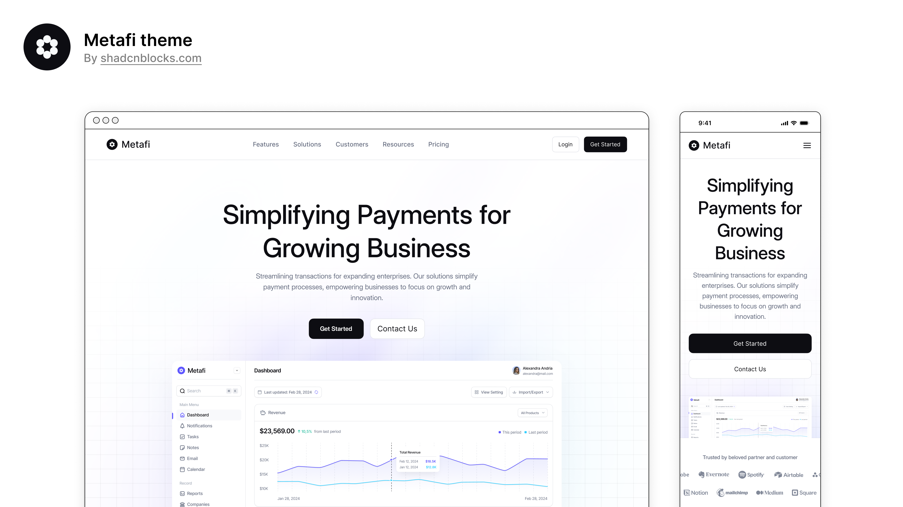

# Metafi NextJS Template

Metafi NextJS Template is a premium template built by https://www.shadcnblocks.com

- [Demo](https://Metafi-nextjs-template.vercel.app/)
- [Documentation](https://docs.shadcnblocks.com/templates/getting-started)

## Screenshot



## Getting Started

This project uses [Bun](https://bun.sh). Install Bun first (if needed):

```bash
curl -fsSL https://bun.sh/install | bash
```

Then install dependencies and run:

```bash
bun install
```

```bash
bun run dev
```

Open [http://localhost:3000](http://localhost:3000) with your browser to see the result.

## Tech Stack

- Nextjs 15 / App Router
- Tailwind 4
- shadcn/ui
- Contentful (GraphQL, live preview)

## Contentful & Section Style Editor

This template includes a **Contentful** integration and a custom **Section Style Editor** app.

- **Pages** are fetched by slug (`/page/[slug]`). Content types: **Page** (internalName, slug, sections, ntExperiencesCollection), **Hero**, **FAQ**, **TabbedContent**, **Features**, **DataViz**.
- **Live preview:** Set your Contentful preview URL to your app’s enable-draft endpoint (with secret, slug or entryId+type). Enable-draft sets draft mode and redirects to `/page/[slug]` or `/preview/hero/[entryId]` for Hero-only preview. **When adding new components (e.g. Quote)** that need their own preview: see **[Component live preview (ID-based)](documentation/component-live-preview.md)** so you don’t hit field-name, `type`/`ctype`, or merge-tag issues.
- **Section Style Editor** is a custom Contentful app at `/contentful-app` that edits a JSON `sectionStyle` field on Hero entries. The app is (or can be made) config-driven and assignable to multiple section types (e.g. Hero, CTA, Features) so one app controls layout and styling for any section that supports it. It provides:
  - “Use style override” toggle
  - Background (blur, color, overlay opacity) and Layout (overlay/split, content position, content width)
  - Entry-field and entry-editor locations

**Setup:** Add `CONTENTFUL_SPACE_ID`, `CONTENTFUL_ACCESS_TOKEN`, `CONTENTFUL_PREVIEW_ACCESS_TOKEN`, and `CONTENTFUL_PREVIEW_SECRET` (and optionally `CONTENTFUL_ENVIRONMENT`) to `.env`. In Contentful, create an app pointing to `https://localhost:3000/contentful-app` (use `bun run dev:https` or a tunnel for HTTPS in the iframe). Assign the app to the Hero `sectionStyle` field.

## Documentation

- [Codebase Architecture](documentation/CODEBASE-ARCHITECTURE.md) — Project structure, tech stack, routes
- [Component Reference](documentation/COMPONENT-REFERENCE.md) — Layout and section components
- [Development Guide](documentation/DEVELOPMENT-GUIDE.md) — Adding pages, sections, blog posts
- [Component Live Preview](documentation/component-live-preview.md) — ID-based preview for Contentful blocks
- [Lessons Learned](documentation/lessons-learned.md) — Error patterns and fixes (for debugging)
- [Documentation Index](documentation/README.md) — How to navigate and maintain docs (for agents)

## Cursor / Agent Setup

- **add-contentful-block** agent (`.cursor/agents/add-contentful-block.md`) — Orchestrates adding new Contentful blocks: discovery → content model proposal → implementation with milestones.
- **Skills** — contentful-block-discovery, contentful-block-graphql-types, contentful-block-component, contentful-mcp-create-model, contentful-block-live-preview, contentful-live-preview-verify, continuous-improvement.
- Before adding a block, read `documentation/lessons-learned.md` and follow the add-contentful-block workflow.

## Deploy on Vercel

The easiest way to deploy your Next.js app is to use the [Vercel Platform](https://vercel.com)
